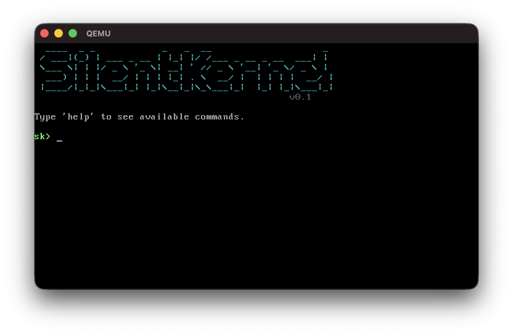

# SilentKernel



minimal x86 kernel written in C. boots from an ISO.

## building

needs an i686-elf cross-compiler + nasm + xorriso.

**macOS:**
```bash
brew install i686-elf-gcc i686-elf-grub nasm xorriso
```

**Ubuntu/Debian:**
```bash
sudo apt install gcc-multilib nasm xorriso grub-pc-bin grub-common
```

**Arch:**
```bash
sudo pacman -S nasm xorriso grub
# AUR: yay -S i686-elf-gcc
```

then:
```bash
make
```

produces `SilentKernel.iso`.

## running

```bash
qemu-system-i386 -cdrom SilentKernel.iso
```

or mount the ISO in VirtualBox/VMware (x86 hosts only).

> Apple Silicon: use QEMU, VirtualBox doesn't do x86 emulation on ARM.

## shell

`help` `clear` `echo` `info` `color` `history` `halt`
